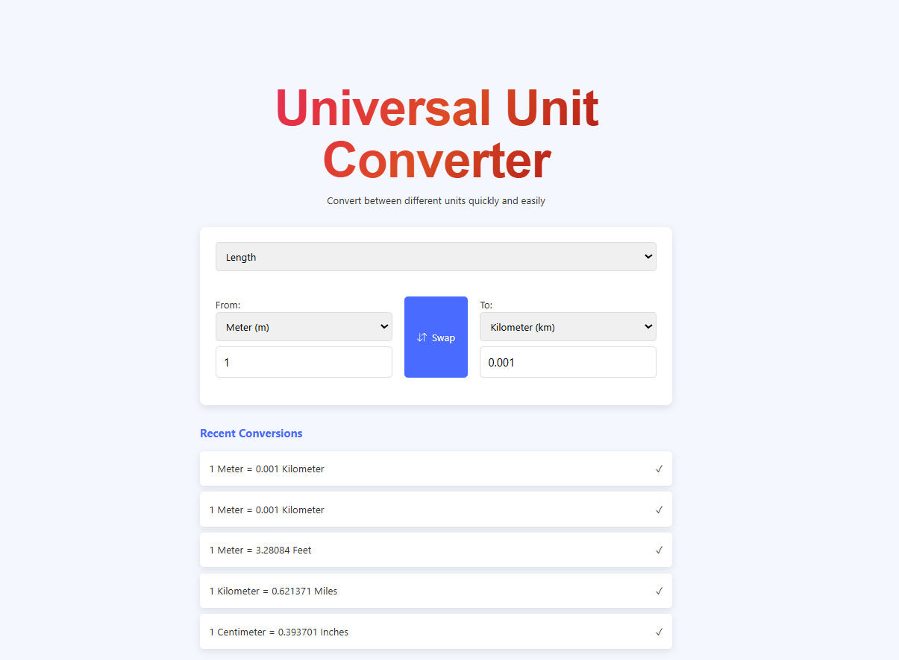

# 🌐 Universal Unit Converter

A **responsive and user-friendly Universal Unit Converter** that allows you to convert between various units quickly and easily.



## ✨ Features

✅ Supports multiple unit categories:

* Length
* Weight
* Temperature
* Area
* Volume
* Time

✅ Swap units with one click
✅ Conversion history tracking
✅ Responsive and clean UI
✅ Built using **HTML**, **CSS**, and **JavaScript**

---

## 🚀 Getting Started

### 1. Clone the repository

```bash
git clone https://github.com/Himanshu-soni3185/universal-unit-converter.git
```

### 2. Navigate to the project folder

```bash
cd universal-unit-converter
```

### 3. Open in browser

Open `index.html` directly in your preferred browser.

---

## 📂 Project Structure

```
universal-unit-converter/
│
├── index.html       # Main HTML file
├── style.css        # Styling
├── script.js        # Conversion logic
└── README.md        # Project documentation
```

---

## 🔧 Future Improvements

* Add more precise temperature conversions
* Enhance history with local storage
* Implement dark/light mode toggle
* Deploy as a Progressive Web App (PWA)

---

## 🤝 Contributing

Contributions, issues, and feature requests are welcome.
Please fork the repository and submit a pull request.

---

### ⭐ Author

Developed by **[Himanshu Soni](https://github.com/Himanshu-soni3185)**

